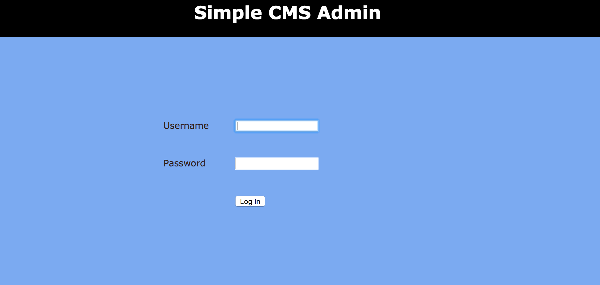
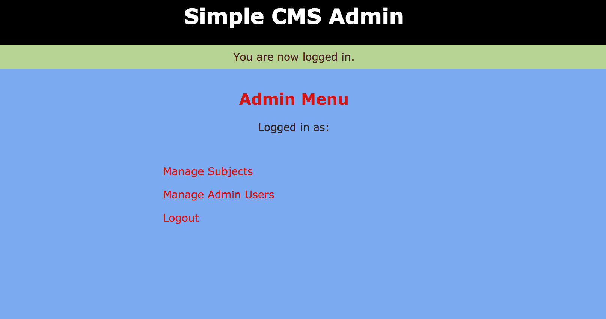
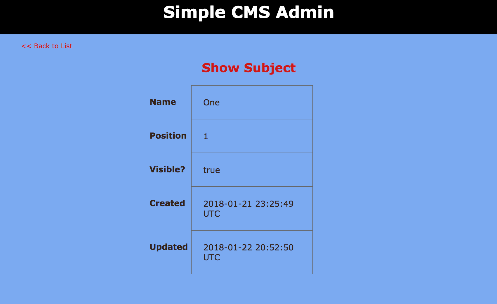
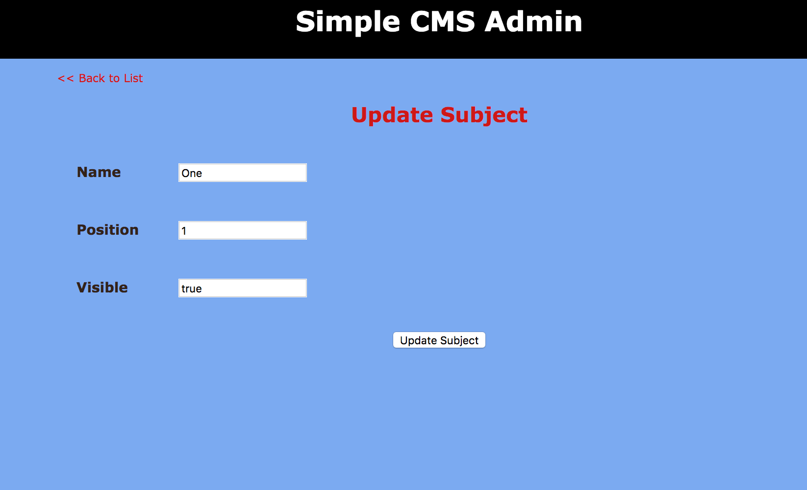

# _Ruby on Rails_

#### By _**Megan Kaluza**_

# _Login_

# _Logged In_

# _Subjects_

# _Show_

# _Edit_

## Description

_Objectives_

* _Create an app using Ruby on Rails._

# _Setup/Installation Requirements_

* Ruby version 2.5.0

* Install xcode: xcode-select --install

* Install Homebrew: /usr/bin/ruby -e "$(curl -fsSL https://raw.githubusercontent.com/Homebrew/install/master/install)"
* Install Ruby: brew install rbenv

* Install/Update RubyGems: gem update --system

* Install Rails: gem install rails

* Install MySQL: brew install mysql

# _Launch Server_

* Clone this repository https://github.com/megankaluza/simple_cms.git

* Launch server: rails s

* Serve on browser of your choice: http://localhost:3000/admin
